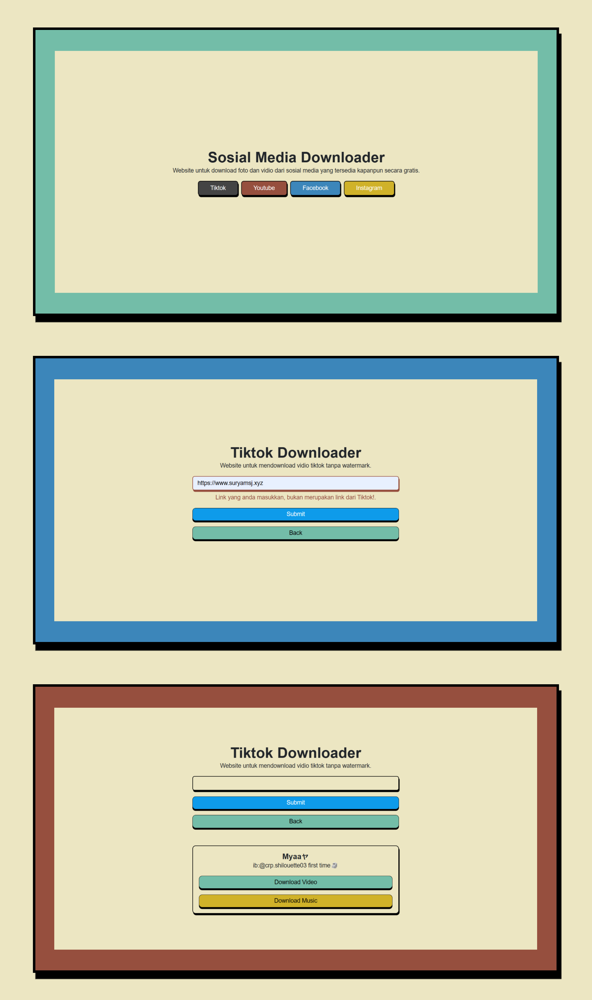

<div align="center" id="top"> 
  

  &#xa0;

  <a href="https://smd-tools.vercel.app/">Demo</a>
</div>

<h1 align="center">Sveltekit Sosmed Downloader</h1>

<p align="center">
  

  

  

  

  

  
</p>

<!-- Status -->

<!-- <h4 align="center"> 
	🚧  Sveltekit Sosmed Downloader 🚀 Under construction...  🚧
</h4> 

<hr> -->

<p align="center">
  <a href="#dart-about">About</a> &#xa0; | &#xa0; 
  <a href="#rocket-technologies">Technologies</a> &#xa0; | &#xa0;
  <a href="#white_check_mark-requirements">Requirements</a> &#xa0; | &#xa0;
  <a href="#checkered_flag-starting">Starting</a> &#xa0; | &#xa0;
  <a href="#memo-license">License</a> &#xa0; | &#xa0;
  <a href="https://github.com/suryamsj" target="_blank">Author</a>
</p>

<br>

## :dart: About ##

Website yang berguna untuk mendownload foto, vidio serta musik dari sosial media seperti Tiktok, Youtube, Instagram dan Facebook. Website ini dibuat dengan menggunakan Sveltekit.

## :rocket: Technologies ##

Teknologi yang digunakan di project ini:

- [Node.js](https://nodejs.org/en/)
- [Sveltekit](https://kit.svelte.dev/)
- [SCSS](https://sass-lang.com/)
- [API](https://api.akuari.my.id/docs)

## :white_check_mark: Requirements ##

Sebelum clone repository ini, pastikan anda mempunyai [Git](https://git-scm.com) dan [Node](https://nodejs.org/en/).

## :checkered_flag: Starting ##

```bash
# Clone this project
$ git clone https://github.com/suryamsj/sveltekit-sosmed-downloader

# Access
$ cd sveltekit-sosmed-downloader

# Install dependencies
$ npm install

# Run the project
$ npm run dev

# The server will initialize in the <http://localhost:5173>
```

## :memo: License ##

Project ini berlisensi MIT. Untuk lebih lanjut, bisa lihat [LICENSE](LICENSE).

Dibuat dengan :heart: oleh <a href="https://github.com/suryamsj" target="_blank">Muhammad Surya J</a>

&#xa0;

<a href="#top">Kembali ke atas</a>
